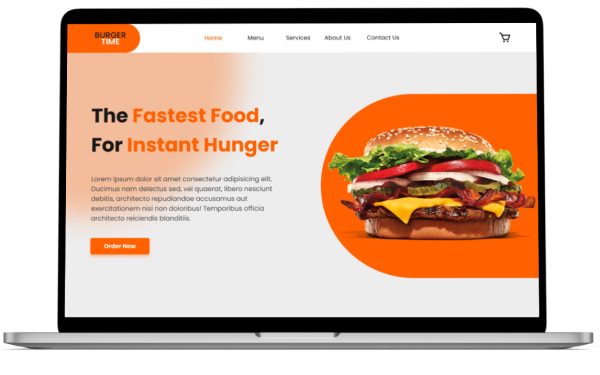

# [**BURGER TIME!** :hamburger:](https://breakfasttimeandburger.netlify.app/)

This project was created to demonstrate my knowledge of the **TypeScript** programming language. It is a small restaurant food ordering app, where you can order burgers, drinks, salads, desserts, and breakfasts.

## Built with

## Getting Started

1. Clone the project
2. yarn install
3. yarn start

## Dependencies

Some dependencies I used were the following:

- **React Router Dom**
- **React Icons**
- **Atropos**
- **Hamburger React**
- **Swiper**

And the following development dependencies:

- **ESLint**
- **Standard**

## Author

Some of my platforms... :smiling_face_with_three_hearts:

- [Frontend Mentor | Christian's profile](https://www.frontendmentor.io/profile/FLCHRIS)
- [GitHub](https://github.com/FLCHRIS)
- [Website](https://christianfl.netlify.app/)

**HAPPY CODING!!** :upside_down_face: :v: